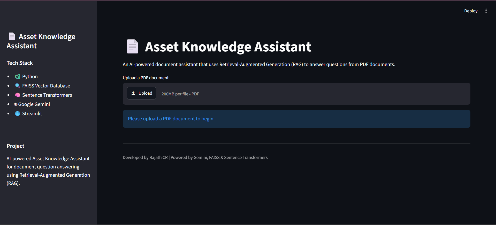
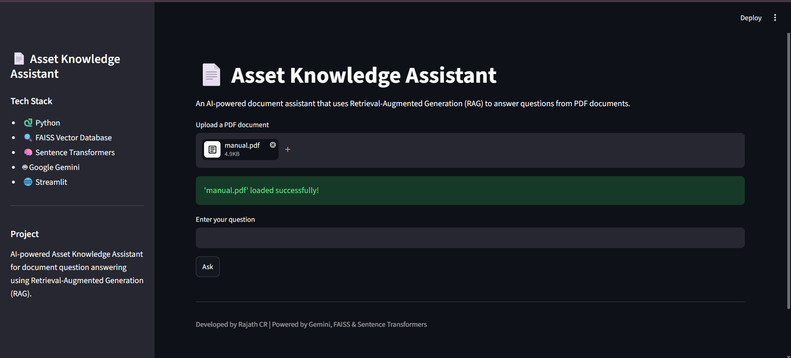
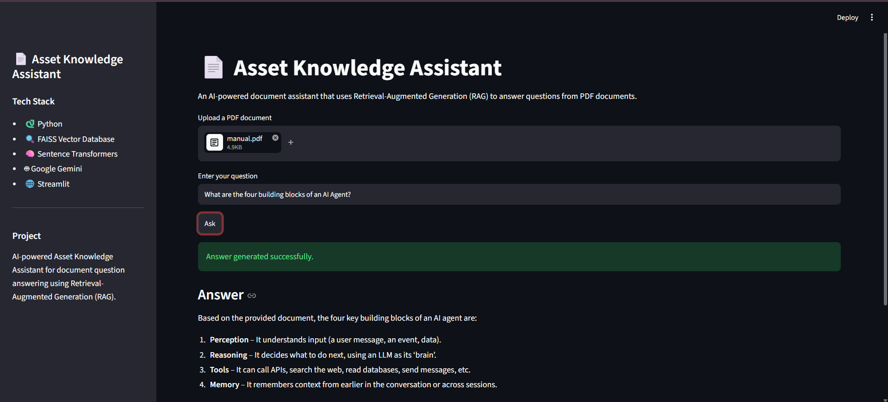

# 📄 Asset Knowledge Assistant

An AI-powered **Retrieval-Augmented Generation (RAG)** application that allows users to upload PDF documents and ask natural-language questions about their contents.

The application retrieves relevant information from the uploaded document using **Sentence Transformers** and **FAISS**, then uses **Google Gemini** to generate accurate, context-aware answers.

---

## ✨ Features

- 📄 Upload any PDF document
- 🤖 Ask natural-language questions
- 🔍 Semantic document search using FAISS
- 🧠 Sentence Transformer embeddings
- 💬 Context-aware answers using Google Gemini
- 🌐 Interactive Streamlit web interface
- ⚡ Fast Retrieval-Augmented Generation (RAG) pipeline

---

## 🛠️ Tech Stack

- Python
- Streamlit
- Google Gemini API
- Sentence Transformers
- FAISS
- PyMuPDF (fitz)
- NumPy

---

## 🏗️ Project Architecture

```text
                User
                  │
                  ▼
          Upload PDF Document
                  │
                  ▼
          PDF Text Extraction
                  │
                  ▼
            Text Chunking
                  │
                  ▼
      Sentence Transformer
            Embeddings
                  │
                  ▼
        FAISS Vector Database
                  │
                  ▼
        User Question
                  │
                  ▼
      Semantic Similarity Search
                  │
                  ▼
      Relevant Context Retrieved
                  │
                  ▼
          Google Gemini API
                  │
                  ▼
           Final AI Answer
```

---

## 📂 Project Structure

```text
PS128-Asset-Knowledge-Assistant
│
├── backend
│   ├── embedder.py
│   ├── llm.py
│   ├── main.py
│   ├── pdf_reader.py
│   ├── rag.py
│   └── vector_store.py
│
├── frontend
│   └── app.py
│
├── data
│   ├── raw
│   └── processed
│
├── scripts
├── .env.example
├── .gitignore
├── requirements.txt
├── LICENSE
└── README.md
```

---

## 🚀 Installation

Clone the repository:

```bash
git clone https://github.com/YOUR_USERNAME/PS128-Asset-Knowledge-Assistant.git
```

Go into the project directory:

```bash
cd PS128-Asset-Knowledge-Assistant
```

Create a virtual environment:

```bash
python -m venv .venv
```

Activate it.

Install dependencies:

```bash
pip install -r requirements.txt
```

Create a `.env` file:

```text
GEMINI_API_KEY=YOUR_API_KEY
```

---

## ▶️ Run the Application

```bash
streamlit run frontend/app.py
```

Open:

```
http://localhost:8501
```

---

## 📸 Screenshots

### Home Page



---

### Upload PDF



---

### Question Answering



## 🔮 Future Improvements

- Support multiple PDF documents
- Chat history
- Source citation for answers
- Hybrid keyword + semantic search
- Docker deployment
- Cloud deployment

---

## 👨‍💻 Author

**Rajath CR**

B.Tech – Computer Science & Engineering (Cybersecurity)

Dayananda Sagar University